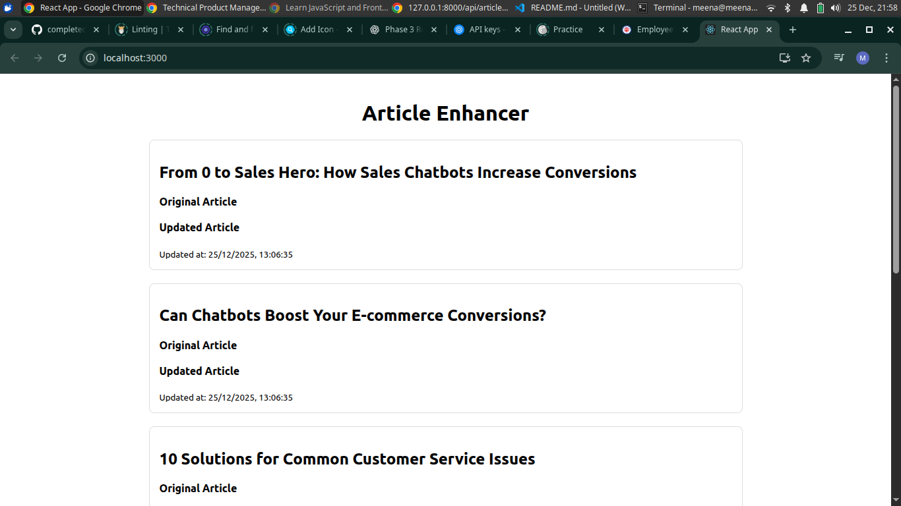
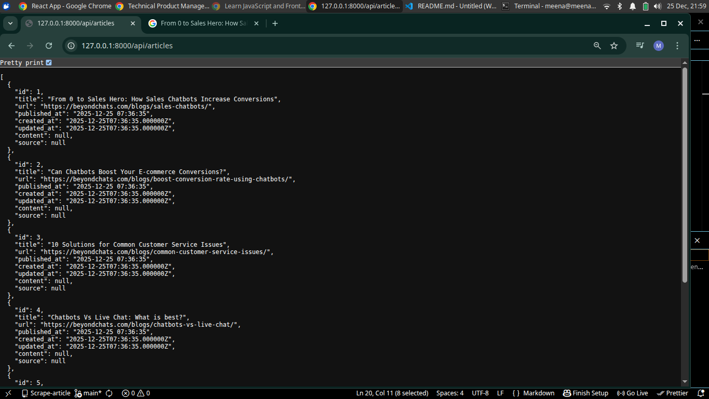
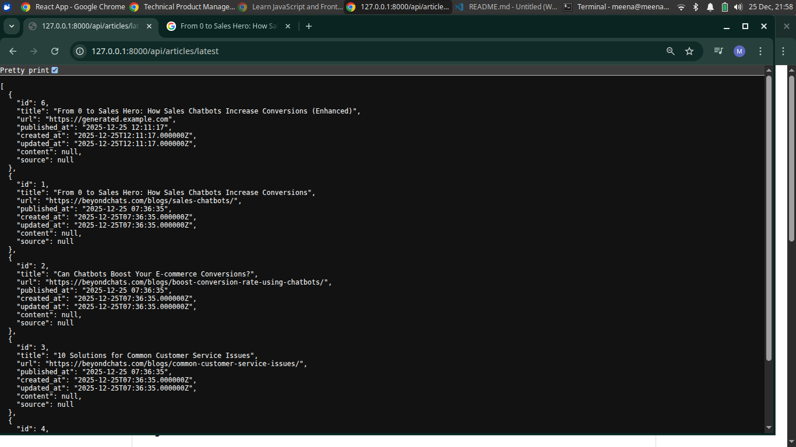

# 📰 Article Scraping & Enhancement System

## 📌 Project Overview
This project is a **3-phase full-stack application** that demonstrates:

- Web scraping
- Backend API development
- Frontend integration

The system scrapes articles from external blogs, enhances the content, and displays
both **original and updated versions** in a ReactJS frontend.

Each phase is implemented independently and documented separately.

---

## Demo

## 🧩 Project Phases

### 🔹 Phase 1 – Article Scraping (Laravel)
- Scrapes articles from external websites
- Extracts article title and content
- Stores data in database
- Prevents duplicate entries

📄 *Detailed implementation available in Phase 1 README*

---

### 🔹 Phase 2 – Article Enhancement APIs (Laravel)
- Enhances / rewrites scraped articles
- Stores updated content
- Exposes REST APIs for frontend usage

📄 *Detailed implementation available in Phase 2 README*

---

### 🔹 Phase 3 – ReactJS Frontend
- Fetches articles from Laravel APIs
- Displays original and updated articles
- Simple and responsive UI

📄 *Detailed implementation available in Phase 3 README*

---

## 🛠️ Technology Stack
- Backend: Laravel (PHP)
- Database: SQLite 
- Frontend: ReactJS
- API Communication: REST APIs, Axios

---

---

## 📌 Notes
- Each phase can be tested independently
- Focus is on clarity and simplicity
- Advanced features were intentionally avoided

---

## ✅ Project Status
✔ Phase 1 Completed  
✔ Phase 2 Completed  
✔ Phase 3 Completed  

---

## 👤 Author
Meena S

